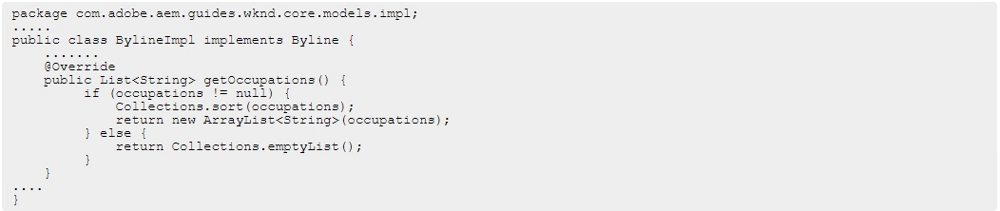

**Pregunta:**
Which attribute must be present in all filter rules in AEM dispatcher configuration?

A. **/type**  
B. /selectors  
C. /url  
D. /glob  

La respuesta correcta es: **A. /type**

**Pregunta:**
Which property under /cache in the dispatcher.any file identifies the directory where cached files are stored?

A. /invalidate  
B. /statfile  
C. **/docroot**  
D. /cacheroot  

La respuesta correcta es: **C. /docroot**

**Pregunta:**
Which environment-specific configuration is used in AEM as a Cloud Service to store private API keys?

A. $[env:ENV_VAR_NAME]  
B. $[env:SECRET_VAR_NAME]  
C. **$[secret:SECRET_VAR_NAME]**  
D. $[secret:ENV_VAR_NAME]  

La respuesta correcta es: **C. $[secret:SECRET_VAR_NAME]**

**Pregunta:**
A developer has to create a Logger and Writer pair for the company's application logging. Which OSGi configurations should the developer use?

A. Apache Sling Logging Logger Configuration and Apache Sling Logging Configuration  
B. Apache Sling Request Logger and Apache Sling Logging Writer Configuration  
C. **Apache Sling Logging Logger Configuration and Apache Sling Logging Writer Configuration**  

La respuesta correcta es: **C. Apache Sling Logging Logger Configuration y Apache Sling Logging Writer Configuration**

**Pregunta:**
If multiple configurations for the same PID are applicable, which configuration is applied?

A. The last modified configuration is applied.  
B. **The configuration with the highest number of matching run modes is applied.**  
C. The one that occurs first in the repository is applied.  
D. A configuration factory is created and all configurations are applied.  

La respuesta correcta es: **B. The configuration with the highest number of matching run modes is applied.**

**Pregunta:**
Which configuration/section should be used to resolve the domain name by dispatcher?

A. Configuration in vhosts file  
B. Configuration in filters.any  
C. **Configuration in httpd.conf**  
D. Configuration in DNS  

La respuesta correcta es: **C. Configuration in httpd.conf**

**Pregunta:**
Which configuration must be applied to enable re-fetching of cached items based on Cache Headers sent by AEM?

A. /autoInvalidate true  
B. /autoInvalidate "1" 
C. /enableTTL true  
D. **/enableTTL "1"**  

La respuesta correcta es: **D. /enableTTL "1"**

**Pregunta:**
A developer needs to create a runmode-specific OSGi configuration for an AEM as a Cloud Service implementation. In which location should the OSGi configuration be created?

A. core project, (/core/..,/config.<runmode>) folder  
B. ui.config project, (/config/.../config.<runmode>) folder  
C. all project, (/all/.../config.<runmode>) folder  
D. **ui.apps project, (/apps/.../config.<runmode>) folder**  

La respuesta correcta es: **D. ui.apps project, (/apps/.../config.<runmode>) folder**

**Pregunta:**
An AEM application wants to set up multi-tenancy using Adobe-recommended best practices and bind multiple configurations to it. Which of the following options is recommended?

A. `import org.apache.felix.scr.annotations.Component; @Component(label = “My configuration”, metatype = true, factory= true)`

B. `import org.osgi.service.component.annotations.Component; @Component(service = ConfigurationFactory.class)`

C. `import org.osgi.service.metatype.annotations.AttributeDefinition; import org.osgi.service.metatype.annotations.ObjectClassDefinition; @ObjectClassDefinition(name = “My configuration”)`

D. `import org.osgi.service.component.annotations.Component; import org.osgi.service.metatype.annotations.Designate; @Component(service = ConfigurationFactory.class) @Designate(ocd = ConfigurationFactorylmpl.Config.class, factory=true)`

La respuesta correcta es: **D. `import org.osgi.service.component.annotations.Component; import org.osgi.service.metatype.annotations.Designate; @Component(service = ConfigurationFactory.class) @Designate(ocd = ConfigurationFactorylmpl.Config.class, factory=true)`**

Aquí está la pregunta y las respuestas en formato Markdown, con las respuestas correctas en negrita:

**Pregunta:**
An AEM application requires LDAP Service integration to synchronize users/groups. Which two OSGi configurations are required for LDAP integration in AEM? (Choose two.)

A. Apache Jackrabbit Oak AuthorizableActionProvider

B. Apache Jackrabbit Oak Solr server provider

C. Apache Jackrabbit Oak CUG Configuration

D. **Apache Jackrabbit Oak External Login Module**

E. **Apache Jackrabbit Oak Default Sync Handler**

Las respuestas correctas son: **D. Apache Jackrabbit Oak External Login Module** y **E. Apache Jackrabbit Oak Default Sync Handler**.

**Pregunta:**
A client is having issues with some query results:
Many of the client's industry terms have the same meaning, and users do not always search the exact wording
Many users search by typing in short phrases instead of exact keywords, ex:// “cats and dogs”
What index analyzers should the AEM developer recommend?

A. 1. Add a Mapping filter to the current indexes
2. Add a Stop filter to the current indexes

B. 1. Tokenize the current indexes with a Keyword tokenizer
2. Add a Mapping filter to the current indexes

C. **1. Add a Synonym filter to the current indexes**  
    **2. Add a Stop filter to the current indexes**

D. 1. Add a Synonym filter to the current indexes
2. Add a LowerCase filter to the current indexes

La respuesta correcta es: **C. 1. Add a Synonym filter to the current indexes 2. Add a Stop filter to the current indexes**

Aquí está la pregunta y la respuesta en formato Markdown, con la respuesta correcta en negrita:

**Pregunta:**
An AEM server is overloaded with too many concurrently running workflows. The developer decides to reduce the number of concurrent workflows.
What should be configured to reduce the number of concurrent workflows?

A. The number of threads in Scheduler  
B. The number of threads in Apache Felix Jetty Http Service  
C. Launchers for each workflow  
D. **Maximum Parallel Jobs in OSGI console**

La respuesta correcta es: **D. Maximum Parallel Jobs in OSGI console**

Aquí está la pregunta y las respuestas en formato Markdown, con las respuestas correctas en negrita:

**Pregunta:**
A custom component has one dialog field:  

The developer needs to implement a Sling Model to perform business logic on the authored value. The developer writes the following HTL snippet.  

Which two implementations will support this HTL snippet? (Choose two.)

A.   
**B.**   
**C.**   
D.   
E. 

Las respuestas correctas son:  
**B.**  
  
y **C.**  
  

Aquí está la pregunta y la respuesta en formato Markdown, con la respuesta correcta en negrita:

**Pregunta:**
A developer needs to create a new Title component. The requirements are:
1. The layout must be the same as the Title core component
2. The text property must have the page title as a prefix (e.g., Page Title - <component text>)
3. The component must be reusable
   Which approach is recommended?

A. 1. Create a Proxy Component of Title core component
2. Create a Custom Sling Model that overrides the default behavior
3. Customize the component template

B. 1. Create a custom component from scratch
2. Create a Custom Sling Model for the component that follows the requirement
3. Create a Model Exporter

C. **1. Create a Proxy Component from Title core component**  
**2. Create a Custom Sling Model that overrides the default behavior**

La respuesta correcta es: **C. 1. Create a Proxy Component from Title core component 2. Create a Custom Sling Model that overrides the default behavior**

**Pregunta:**
A developer needs to create Sling Models for two fields, name and occupations. The dialog has two fields, name - a single value field, and occupations - a multi-value field. The following code is included in Sling Models inherited from the interface `com.adobe.aem.guides.wknd.core.models.Byline`.

Which method should be used to represent this model in HTL?

A. ****  
B.   
C.   
D. 

La respuesta correcta es: **A. **

**Pregunta:**
SPA components are connected to AEM components via the MapTo() method. Which code should be used to correctly connect an SPA component called `ItemList` to its AEM equivalent?

A. (`project/components/content/itemList`).MapTo(ItemList, ItemListEditConfig);  
B. **MapTo(`project/components/content/itemList`)(ItemList, ItemListEditConfig);**  
C. `ItemList`.MapTo(`project/components/content/itemList`);  
D. MapTo(ItemList)(`project/components/content/itemList`, ItemListEditConfig);

La respuesta correcta es: **B. MapTo(`project/components/content/itemList`)(ItemList, ItemListEditConfig);**

**Pregunta:**
Refer to the exhibit.

The current page has three children.

What is the final rendered HTML output for the code snippet?

A.   
B.   
C.   
**D. **

La respuesta correcta es: **D. **

**Pregunta**
A developer needs to create a dynamic participant step where the participant is selected automatically at run time. The developer decides to develop an OSGi service, which needs to implement the `com.day.cq.workflow.exec.ParticipantStepChooser` interface. Which method should the developer implement from the `com.day.cq.workflow.exec.ParticipantStepChooser` interface?

A. **`String getParticipant(WorkItem workItem, WorkflowSession workflowSession, MetaDataMap metaDataMap)`**  
B. `void getParticipant(WorkItem workItem, WorkflowSession workflowSession, MetaDataMap metaDataMap)`  
C. `String getDynamicParticipant(WorkItem workItem, WorkflowSession workflowSession, MetaDataMap metaDataMap)`  
D. `void getDynamicParticipant(WorkItem workItem, WorkflowSession workflowSession, MetaDataMap metaDataMap)`

La respuesta correcta es: **A. `String getParticipant(WorkItem workItem, WorkflowSession workflowSession, MetaDataMap metaDataMap)`**

**Pregunta:**
An AEM application has a Header and Footer authored on every page. The customer asks for the following:
1. A centralized Header and Footer
2. The ability to create a variation for both the Header and Footer
3. Change the Header and Footer for specific time periods
4. The ability to restore a previous version for both the Header and Footer

¿Qué debería usar el desarrollador para cumplir con los requisitos?

A. Custom component  
B. Content fragment  
C. Static template  
D. **Experience fragment**

La respuesta correcta es: **D. Experience fragment**

**Pregunta:**
AEM SPA integration provides various design models. In an application, the developer chooses to use AEM as a headless CMS without using the SPA Editor SDK framework. What would be an advantage for this design model?

A. The content author can edit the app using AEM's content authoring experience.  
B. **The developer has full control over the app.**  
C. The SPA is compatible with the template editor.  
D. The developer keeps control over the app by only enabling authoring in restricted areas of the app.

La respuesta correcta es: **B. The developer has full control over the app.**

**Pregunta:**
An AEM Developer needs to create a new component to help support a new product launch. The client is on AEM 6.5 on-premise with the latest version of WCM Core Components. The component must include text, image, and a link. The component must support multiple designs. Which process should the AEM Developer use to support the launch?

**A.**  
1. **Extend the Teaser Component from Core Components**  
2. **Create style variations to be used in the Style System**

B.  
1. Create a new component by extending the Text Component from Core Components  
2. Add dialog properties and modify HTL to support images  

C.  
1. Extend the Text Component from Core Components  
2. Enable image manipulations for the Text Component via policy  

D. 
1. Create a new Image with Text component that exposes the Core Components authoring dialogs for those components  
2. Add a policy to define which designs are used  

La respuesta correcta es:  
**A.**
1. **Extend the Teaser Component from Core Components**
2. **Create style variations to be used in the Style System**

**Pregunta:**
An AEM application is expected to export a content fragment in JSON format without any customization for a headless implementation. What is the recommended approach?

A. Use AEM Assets HTTP API
B. Use Core components to export JSON
C. **Use Sling Exporter framework**

La respuesta correcta es: **C. Use Sling Exporter framework**

**Pregunta:**
In a non-optimized website, the final HTML generated for a typical page by the publish instance includes a relatively large number of `<script>` elements that refer to other script files loaded from AEM environment. The developer wants to minimize these network calls by combining all required client library code into a single file to reduce the number of back-and-forth requests on page load. Which step should a developer take to solve this issue?

A. Embed the required libraries into an app-specific client library using the allowProxy property of the cq:ClientLibraryFolder node  
B. Add the categories property of the cq:ClientLibraryFoider node into an app-specific client library folder  
C. Embed the required libraries into an app-specific client library using the dependencies property of the cq:ClientLibraryFolder node  
D. **Embed the required libraries into an app-specific client library using the embed property of the cq:ClientLibraryFolder node**

La respuesta correcta es: **D. Embed the required libraries into an app-specific client library using the embed property of the cq:ClientLibraryFolder node**

An AEM application development team is assigned a task to create an Event-Driven Data Layer implementation for an Analytics solution.
Which Adobe recommended best practice should the developer choose?

A. Use Adobe Experience Platform's data layer to integrate with AEM.  
B. Create a custom data layer and add each component, template, and its properties to the data layer.  
C. **Use Adobe Client Data Layer and integrate with Core components.**  
D. Create an Adobe Cloud Service configuration to use third-party tool's data layer.  

La respuesta correcta es: **C. Use Adobe Client Data Layer and integrate with Core components.**